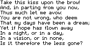

# text-bitmaps
Python module to produce bitmap images containing text for use with small, low-resolution displays such as Papirus e-paper liquid-crystal displays.

Below is an example of a 200 x 96 pixel, black-and-white image produced with this module, as it would appear on the Papirus display (this is an LCD display so color 1 is black and zero is white).

