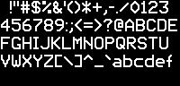

# text-bitmaps
Python module to produce bitmap images containing text for use with small, low-resolution displays such as Papirus e-paper liquid-crystal displays.

Below is photo of a 200 x 96 pixel Papirus e-paper display mounted on a Raspberry PI Zero showing an image generated by this script (see demo below).


The font is based on the Mullard SAA5050 chip (dated July 1982) that was used to display text-based information on TV screens. Many thanks to [bjh21](http://bjh21.me.uk/bedstead/) for providing the raw data for the original fonts as well as a large collection of additional unicode characters.

Bitmaps for the following character sets are included here:

ASCII
- fixed
- proportional

Unicode - Basic Latin (ASCII) and Latin-1 Supplement
- fixed
- proportional

The proportional bitmaps allows more characters per line because certain characters ('i', 'j', etc) have been trimmed.

## Basic Usage

There are two functions.

```
import bitmaps

img = bitmaps.get_char_image(65)
img.show()
```

Produces the following image:


```
text_to_display = "Take this kiss upon the brow!\n" \
                  "And, in parting from you now,\n" \
                  "Thus much let me avow:\n" \
                  "You are not wrong, who deem\n" \
                  "That my days have been a dream;\n" \
                  "Yet if hope has flown away\n" \
                  "In a night, or in a day,\n" \
                  "In a vision, or in none,\n" \
                  "Is it therefore the less gone?\n" \
                  "All that we see or seem\n" \
                  "Is but a dream within a dream."

img, char_count = bitmaps.display_text_prop(text_to_display)
img.show()
img.save("eapoe2.bmp")

print("{} of {} characters displayed.".format(char_count, len(text_to_display)))
```

Produces:


251 of 305 characters displayed.

There are also double-sized versions of all the bitmaps.

```
text_to_display = [chr(c) for c in range(32, 128)]

img, char_count = bitmaps.display_text_prop(text_to_display, display_size=(200, 96), char_size=2)
img.show()
img.save("large_font.bmp")

print("{} of {} characters displayed.".format(char_count, len(text_to_display)))
```

Produces:



72 of 96 characters displayed.

